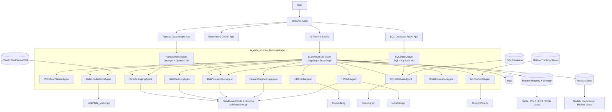
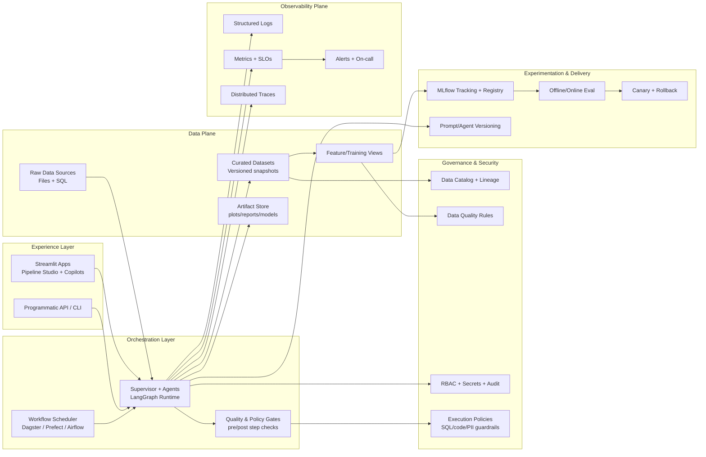
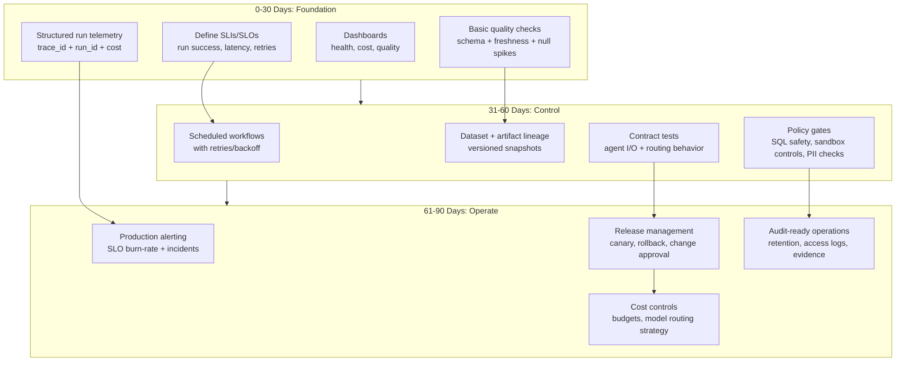
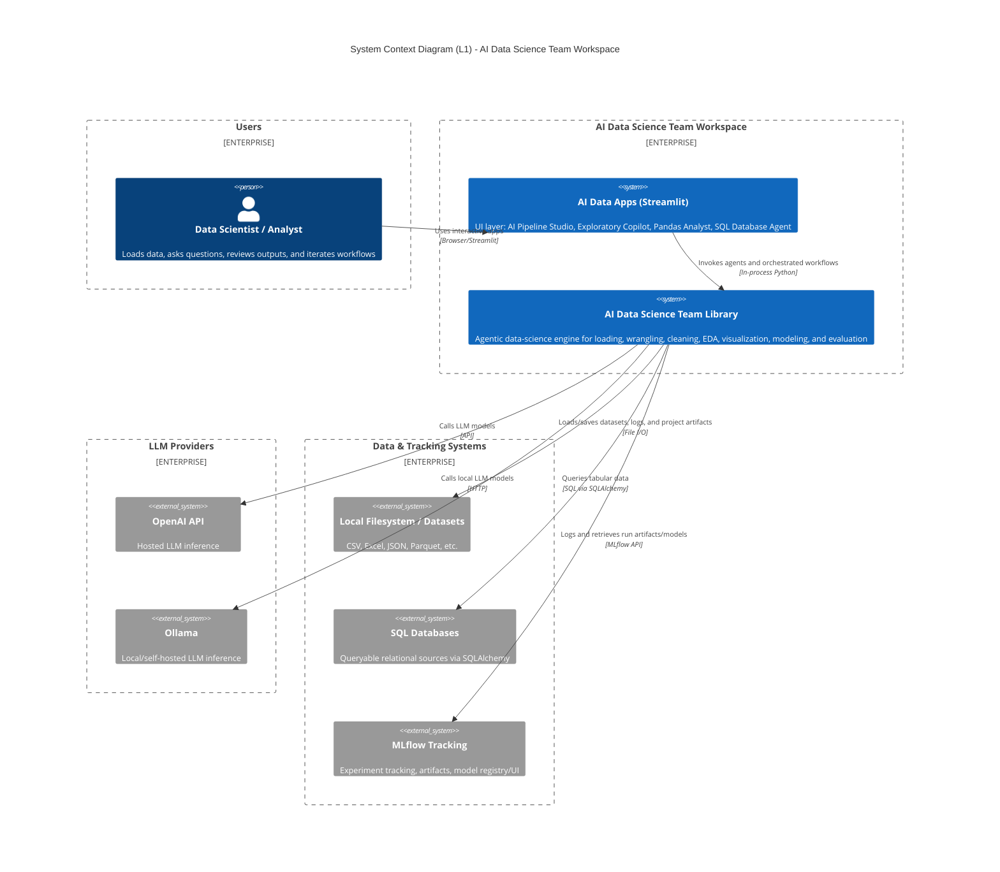
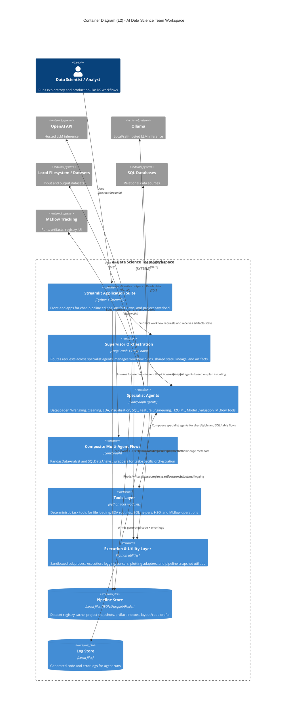

# AI Data Engineering Workspace Summary

_Last updated: 2026-02-24_

## 1) What this solution does

This repository provides an **AI-powered data science platform** composed of:

- A reusable Python package (`ai_data_science_team`) of specialized agents
- Multi-agent orchestration flows (including a supervisor-led team)
- Streamlit applications (flagship: AI Pipeline Studio)
- Example notebooks and sample datasets

The solution supports end-to-end workflows:

1. Discover/load data
2. Wrangle and clean data
3. Run EDA and visualization
4. Perform feature engineering
5. Train/evaluate models (H2O AutoML)
6. Track artifacts/runs in MLflow

---

## 2) How it works (high-level architecture)

## 2.1 Core execution pattern

Most coding agents follow this pattern:

1. **Summarize data/context** for prompt grounding
2. **Recommend steps** (optional, can be bypassed)
3. **Generate Python/SQL code** with strict function/query requirements
4. **Execute code** in a sandboxed subprocess (or DB connection for SQL)
5. **Validate outputs** and capture structured artifacts
6. **Retry/fix loop** if errors occur (`max_retries`, `retry_count`)
7. **Return messages + artifacts + error state**

## 2.2 Base framework

- `BaseAgent` in `templates/agent_templates.py` standardizes invoke/stream/state access.
- LangGraph `StateGraph` workflows compile into runnable graphs.
- ReAct-style agents (loader/EDA/MLflow tools) call concrete tool functions.
- Utility modules handle logging, sandbox execution, parser normalization, plot conversion, and pipeline snapshots.

## 2.3 Orchestration layers

- **Single-task agents**: cleaning, wrangling, viz, SQL, feature engineering, etc.
- **Composite analysts**: 
  - `PandasDataAnalyst` (wrangle + optional chart)
  - `SQLDataAnalyst` (SQL + optional chart)
- **Supervisor team** (`supervisor_ds_team.py`): routes user intent across workers, manages shared state/datasets/artifacts, and coordinates workflow planning + execution.

---

## 3) Workspace structure summary

- `ai_data_science_team/`: core library (agents, tools, templates, utils, multiagents)
- `apps/`: Streamlit frontends
  - `ai-pipeline-studio-app/` (flagship, pipeline-first UX)
  - `exploratory-copilot-app/`
  - `pandas-data-analyst-app/`
  - `sql-database-agent-app/`
- `examples/`: notebooks demonstrating each agent/workflow
- `data/`: sample datasets for demos/tests
- `planning_docs/`: architecture and roadmap notes (notably Pipeline Studio evolution)

---

## 4) Agent I/O contract map (second pass)

Notes:
- “Inputs” are the primary state keys expected at invocation time.
- “Outputs” are principal state/artifact keys exposed by graph state/getters.
- Keys shown are based on explicit `TypedDict` state schemas + invoke/getter methods.

## 4.1 Core coding agents

### DataCleaningAgent

**Primary inputs**
- `messages`
- `user_instructions`
- `data_raw`
- `max_retries`
- `retry_count`

**Primary outputs**
- `data_cleaned`
- `data_cleaner_function`
- `recommended_steps`
- `data_cleaning_summary`
- `data_cleaner_error`
- `data_cleaner_error_log_path`

### DataWranglingAgent

**Primary inputs**
- `messages`
- `user_instructions`
- `data_raw` (single dataset dict or list of dataset dicts)
- `max_retries`
- `retry_count`

**Primary outputs**
- `data_wrangled`
- `data_wrangler_function`
- `recommended_steps`
- `data_wrangling_summary`
- `data_wrangler_error`
- `data_wrangler_error_log_path`

### FeatureEngineeringAgent

**Primary inputs**
- `messages`
- `user_instructions`
- `data_raw`
- `target_variable` (optional but commonly used)
- `max_retries`
- `retry_count`

**Primary outputs**
- `data_engineered`
- `feature_engineer_function`
- `recommended_steps`
- `feature_engineer_error`
- `feature_engineer_error_log_path`

### DataVisualizationAgent

**Primary inputs**
- `messages`
- `user_instructions`
- `data_raw`
- `max_retries`
- `retry_count`

**Primary outputs**
- `plotly_graph`
- `data_visualization_function`
- `recommended_steps`
- `data_visualization_summary`
- `data_visualization_warning`
- `data_visualization_error`
- `data_visualization_error_log_path`

### SQLDatabaseAgent

**Primary inputs**
- `messages`
- `user_instructions`
- `max_retries`
- `retry_count`
- external `connection` supplied at construction

**Primary outputs**
- `data_sql`
- `sql_query_code`
- `sql_database_function`
- `recommended_steps`
- `sql_database_error`
- `sql_database_error_log_path`

### H2OMLAgent

**Primary inputs**
- `messages`
- `user_instructions`
- `data_raw`
- `target_variable`
- `max_retries`
- `retry_count`

**Primary outputs**
- `leaderboard`
- `best_model_id`
- `model_path`
- `model_results`
- `h2o_train_function`
- `recommended_steps`
- `h2o_train_error`
- `h2o_train_error_log_path`

---

## 4.2 Tool/ReAct agents

### DataLoaderToolsAgent

**Primary inputs**
- `messages` or `user_instructions`

**Primary outputs**
- `data_loader_artifacts`
- `tool_calls`
- `internal_messages`
- `messages`

### EDAToolsAgent

**Primary inputs**
- `messages` or `user_instructions`
- `data_raw`

**Primary outputs**
- `eda_artifacts`
- `tool_calls`
- `internal_messages`
- `messages`

### MLflowToolsAgent

**Primary inputs**
- `messages` or `user_instructions`
- optional `data_raw` for prediction/tool contexts

**Primary outputs**
- `mlflow_artifacts`
- `tool_calls`
- `internal_messages`
- `messages`

### WorkflowPlannerAgent

**Primary inputs**
- `messages`
- optional `context`
- optional `user_instructions`

**Primary outputs (`get_plan`)**
- `steps` (allowed canonical step IDs)
- `target_variable`
- `questions`
- `notes`

---

## 4.3 Deterministic evaluator

### ModelEvaluationAgent

**Primary inputs**
- `messages`
- `data_raw` (DataFrame)
- optional `model_artifacts` (`model_path`, `best_model_id`)
- `target_variable`
- `test_size`
- `random_state`

**Primary outputs**
- `eval_artifacts`
- `messages`

`eval_artifacts` includes fields such as task type, metrics, model identifiers, and optional Plotly figure payloads.

---

## 4.4 Multi-agent wrappers

### PandasDataAnalyst (wrangle + optional viz)

**Primary state keys**
- Inputs/routing: `messages`, `user_instructions`, `user_instructions_data_wrangling`, `user_instructions_data_visualization`, `routing_preprocessor_decision`, `data_raw`
- Outputs: `data_wrangled`, `data_wrangler_function`, `data_visualization_function`, `plotly_graph`, `plotly_error`

### SQLDataAnalyst (SQL + optional viz)

**Primary state keys**
- Inputs/routing: `messages`, `user_instructions`, `user_instructions_sql_database`, `user_instructions_data_visualization`, `routing_preprocessor_decision`
- SQL outputs: `sql_query_code`, `sql_database_function`, `data_sql`
- Viz outputs: `plotly_graph`, `plotly_error`, `data_visualization_function`

### Supervisor DS Team

Shared team state includes:
- Conversation/routing: `messages`, `next`, `last_worker`, `handled_steps`, `workflow_plan`
- Dataset management: `datasets`, `active_dataset_id`, `active_data_key`, `target_variable`
- Data/artifacts: `data_raw`, `data_sql`, `data_wrangled`, `data_cleaned`, `feature_data`, `viz_graph`, `eda_artifacts`, `model_info`, `eval_artifacts`, `mlflow_artifacts`, `artifacts`

This layer is the main cross-agent coordinator used by Pipeline Studio.

---

## 5) Failure modes and handling

## 5.1 Common cross-agent failures

- LLM-generated code/query is syntactically or semantically invalid
- Output schema mismatch (non-table output where a table is expected)
- Missing required input fields (`data_raw`, `target_variable`, etc.)
- External dependency not installed (`h2o`, `mlflow`, optional EDA libs)
- Token/context pressure for large schemas/datasets

**Handling pattern:**
- store `*_error` keys
- optional log paths (`*_error_log_path`)
- retry/fix cycle through generated patch code
- fallback defaults in some routers (e.g., default to table mode)

## 5.2 SQL-specific safeguards

- SQL validation blocks unsafe/empty queries in safe mode
- schema-aware prompting + optional smart schema pruning reduce invalid column/table references
- explicit no-DML/no-schema-change guidance in prompts

## 5.3 Visualization-specific safeguards

- missing-column extraction and alias suggestions attempt auto-recovery
- Plotly reconstruction checks detect invalid chart payloads
- explicit warning/error separation (`data_visualization_warning` vs `data_visualization_error`)

## 5.4 Modeling/evaluation-specific safeguards

- H2O import/init guarded; target presence/type checks before training/eval
- ModelEvaluationAgent returns actionable messages when model/data/target is missing
- MLflow logging errors are treated as non-fatal in H2O flow where possible

---

## 6) App layer summary

## AI Pipeline Studio (flagship)

The Studio is a pipeline-centric workspace with lineage-aware datasets and artifact views (Table/Chart/EDA/Code/Model/Predictions/MLflow), including:
- visual editor/canvas concepts
- manual + AI node execution
- save/load project modes (metadata-only or full-data)
- reproducible script/spec generation
- lineage operations (replay, stale marking, undo/redo, compare)

## Other apps

- Exploratory Copilot: EDA-first chat workflow over uploaded/demo data
- Pandas Data Analyst App: natural-language wrangling + optional chart routing
- SQL Database Agent App: natural-language SQL querying with table results

---

## 7) Current maturity and gaps

**Mature/strong areas**
- Practical app UX for iterative DS workflows
- Broad task coverage across data prep, EDA, ML, and MLflow
- Structured stateful orchestration with artifact propagation

**Known gaps**
- Top-level `orchestration.py` remains mostly TODO
- Some flows are large/complex and rely on prompt robustness
- Beta status implies potential breaking API/behavior changes

---

## 8) Practical takeaway

This workspace is best viewed as a **modular AI DS operating system**:
- single agents for focused tasks,
- composite agents for common analyst interactions,
- and a supervisor + Pipeline Studio for end-to-end, reproducible, multi-step workflows.

---

## 9) One-page architecture diagram (Mermaid)



---

## 11) DataOps Reference Architecture (Recommended Next Layer)

This section outlines a practical DataOps layer to make the current agentic platform production-ready for reliability, governance, and scale.

### 11.1 Operating Model (DataOps + MLOps + LLMOps)



### 11.2 Capability Map and Priority Sequence



### 11.3 Minimal Target Stack (fit-for-purpose now)

- Orchestration: Prefect or Dagster for scheduled/managed pipeline execution.
- Observability: OpenTelemetry + Prometheus/Grafana + centralized logs.
- Data quality: Great Expectations or Soda checks at ingestion and pre-model steps.
- Metadata/lineage: OpenLineage-compatible metadata collection and dataset fingerprint tracking.
- Governance: secret management, role-based access, policy checks before SQL/code execution.
- Delivery: prompt/agent versioning with canary rollout and rollback playbooks.

### 11.4 DataOps Control Overlay on C4 Level 2

```mermaid
flowchart TB
  subgraph CORE[C4 Level 2 Containers (Current)]
    APPS[Streamlit Application Suite]
    SUP[Supervisor Orchestration]
    AGENTS[Specialist Agents]
    MULTI[Composite Multi-Agent Flows]
    TOOLS[Tools Layer]
    UTILS[Execution & Utility Layer]
    PSTORE[(Pipeline Store)]
    LSTORE[(Log Store)]
  end

  subgraph CTRL[DataOps Control Plane (Recommended)]
    ORCH[Workflow Orchestration\nSchedules + retries + backoff]
    OBS[Observability\nLogs/Metrics/Traces + SLOs]
    DQ[Data Quality\nSchema/freshness/volume checks]
    LIN[Lineage & Metadata\nOpenLineage + dataset fingerprinting]
    GOV[Governance\nRBAC, secrets, audit, PII policy]
    REL[Release Controls\nPrompt/agent versioning, canary, rollback]
  end

  subgraph EXT[External Systems]
    SRC[Data Sources\nFiles + SQL]
    LLM[LLM Providers\nOpenAI/Ollama]
    MLF[MLflow Tracking]
    ALERT[Alerting/On-call]
  end

  APPS --> SUP
  APPS --> MULTI
  SUP --> AGENTS
  MULTI --> AGENTS
  AGENTS --> TOOLS
  AGENTS --> UTILS
  SUP --> PSTORE
  APPS --> PSTORE
  AGENTS --> LSTORE

  AGENTS --> SRC
  AGENTS --> LLM
  AGENTS --> MLF

  ORCH --> SUP
  ORCH --> MULTI
  OBS --> SUP
  OBS --> AGENTS
  OBS --> LSTORE
  OBS --> ALERT
  DQ --> AGENTS
  DQ --> PSTORE
  LIN --> SUP
  LIN --> PSTORE
  GOV --> SUP
  GOV --> AGENTS
  GOV --> TOOLS
  REL --> SUP
  REL --> AGENTS

  classDef control fill:#eef7ff,stroke:#4a90e2,stroke-width:1px;
  class ORCH,OBS,DQ,LIN,GOV,REL control;
```

---

## 12) Glossary (Project Terminology)

- **Team**: A coordinated group of specialized agents operating under shared state and routing logic to complete end-to-end workflows.
- **Agent**: A role-focused execution unit (e.g., DataCleaningAgent, SQLDatabaseAgent, H2OMLAgent) that performs a specific skill.
- **Worker**: The active agent selected by the orchestrator to run the next step for a given request.
- **Orchestrator / Supervisor**: The routing and coordination layer (supervisor DS team) that decides which worker runs next, manages state, and aggregates artifacts.
- **Tool**: A deterministic callable function used by an agent (e.g., file loading, EDA routines, SQL helpers, MLflow operations).
- **Multi-agent flow**: A wrapper composition of agents for common tasks (e.g., PandasDataAnalyst, SQLDataAnalyst).
- **Artifact**: Structured output produced by runs (tables, plotly graphs, EDA reports, model/eval info, MLflow run details).

---

## 13) DataOps Operating Table (Control → Owner → KPI → Tooling)

| Control Area | Suggested Owner | Core KPI / SLO | Practical Tooling (Current Fit) |
|---|---|---|---|
| Workflow Orchestration | Data Platform / MLOps Engineer | Run success %, median + p95 duration, retry rate | Prefect or Dagster, cron-backed schedules |
| Observability | Platform / SRE | Error rate, SLO burn rate, MTTR, alert precision | OpenTelemetry, Prometheus + Grafana, centralized logs |
| Data Quality | Analytics Engineering / DataOps | Freshness SLA, schema drift incidents, null/volume anomaly rate | Great Expectations or Soda checks |
| Lineage & Metadata | Data Governance / Platform | % runs with complete lineage, reproducibility pass rate | OpenLineage-compatible metadata capture, dataset fingerprints |
| Governance & Security | Security + Data Governance | Access violations, secrets exposure incidents, audit completeness | RBAC, secrets manager, policy checks for SQL/code/PII |
| Agent Quality | AI Engineering | Routing accuracy, invalid-code rate, fallback frequency | Contract tests, regression prompt suites, golden datasets |
| Release Management | AI Engineering + Platform | Change failure rate, rollback time, canary success rate | Versioned prompts/agents, staged rollout, rollback automation |
| Cost / FinOps | Engineering Manager / FinOps | Cost per run, cost per successful run, budget variance | Usage telemetry, model routing policies, budget alerts |

### 13.1 Suggested Review Cadence

- **Daily**: failed runs, high-severity alerts, freshness breaches.
- **Weekly**: routing accuracy, retry hotspots, top-cost workflows.
- **Monthly**: SLO trends, control effectiveness, roadmap reprioritization.

---

## 10) C4 Model Diagrams (Mermaid)

### Level 1: System Context Diagram



### Level 2: Container Diagram



